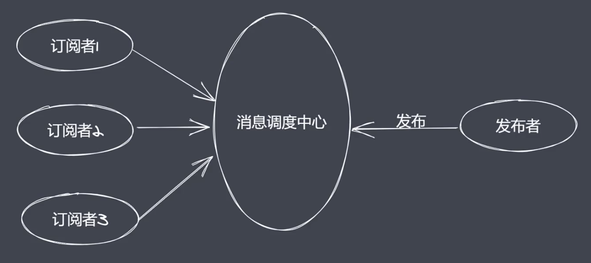
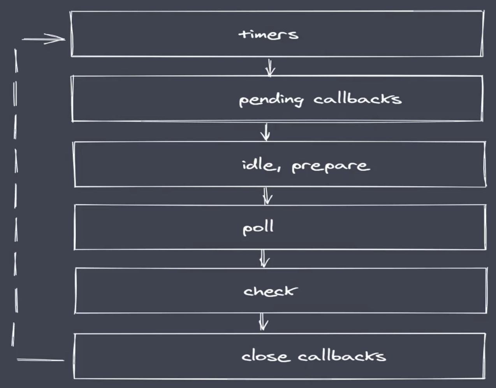
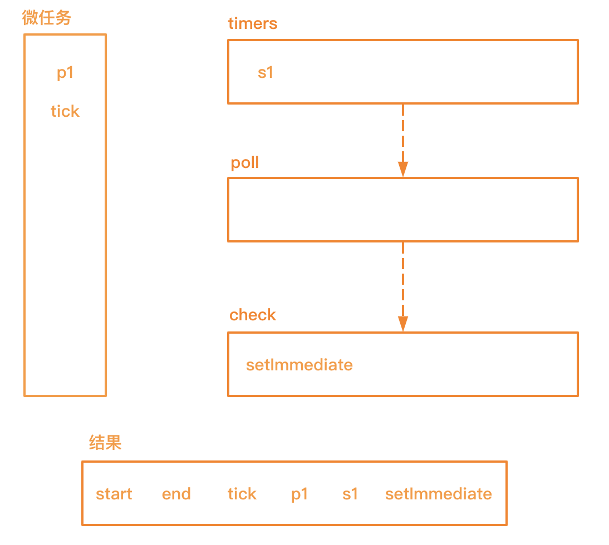

# Events

## Events 与 EventEmiter

- node.js是基于事件驱动的异步操作架构，内置events模块

- events模块提供了EventEmiter类

- node.js中很多内置核心模块继承了EventEmitter

## EventEmitter常见API

- on：添加事件被触发时调用的回调函数

- emit：触发事件，按照注册的顺序同步调用每个事件监听器

- once：添加回调函数，该回调只在首次被触发时调用

- off：移除特定的监听器

```js
const EventEmitter = require('events')

const ev = new EventEmitter()

// on
ev.on('事件1', () => {
  console.log('事件1执行了') // 事件1执行了
})
ev.on('事件1', () => {
  console.log('事件1执行了----2') // 事件1执行了----2
})
// emit
ev.emit('事件1')
ev.emit('事件1')


// once
// 由于是once，多次触发也只会执行一次
ev.once('事件1', () => {
  console.log('事件1执行了') // 事件1执行了
})
ev.once('事件1', () => {
  console.log('事件1执行了----2') // 事件1执行了----2
})
ev.emit('事件1')
ev.emit('事件1')


// off
// 由于off，即使多次触发回调函数也只会执行一次
const cbFn = () => {
  console.log('事件1执行了') // 事件1执行了
}
ev.on('事件1', cbFn)
ev.emit('事件1')
// off
ev.off('事件1', cbFn)
ev.emit('事件1')


// 传参
const cbFn = (...args) => {
  console.log('事件1执行了')
  console.log(args) // [1, 2]
}
ev.on('事件1', cbFn)
ev.emit('事件1', 1, 2)


// 通过this查看EventEmitter内部的大概实现
ev.on('事件1', function () {
  console.log(this)
})
ev.on('事件1', function () {
  console.log(this)
})
ev.on('事件2', function () {
  console.log(this)
})
ev.emit('事件1')
ev.emit('事件2')

// EventEmitter {
//   _events: [Object: null prototype] {
//     '事件1': [ [Function], [Function] ],
//     '事件2': [Function]
//   },
//   _eventsCount: 2,
//   _maxListeners: undefined
// }
```

## 发布订阅模型

定义对象间一对多的依赖关系



### 发布订阅要素

- 缓存队列，存放订阅者信息

- 具有增加、删除订阅的能力

- 状态改变时通知所有订阅者执行监听

**状态发生改变时，发布订阅无法主动通知**

```js
class PubSub {
  _events = []

  constructor() { }

  subscribe(type, callback) {
    if (this._events[type]) {
      this._events[type].push(callback)
    } else {
      this._events[type] = [callback]
    }
  }

  publish(type, ...args) {
    const cbs = this._events[type]
    if (cbs && cbs.length) {
      cbs.forEach(function (cb) {
        cb.call(this, ...args)
      })
    }
  }
}

const pubSub = new PubSub()

pubSub.subscribe('事件1', (...args) => {
  console.log('事件1执行了')
  console.log(args)
})

pubSub.publish('事件1', 1, 2, 3)
```

## Nodejs事件循环机制

Nodejs 不同于浏览器（1个宏任务队列、1个微任务队列），总共有6个宏任务事件队列：timers、pending callbacks、idle/prepare、poll、check、close callbacks。



- timers：执行setTimeout与setInterval回调。

- pending callbacks：执行系统操作的回调，例如：tcp、udp

- idle、prepare：只在系统内部进行使用

- poll：执行与IO相关的回调

- check：执行setImmediate中的回调

- close callbacks：执行close事件的回调

## Nodejs完整事件环

- 执行同步代码，将不同的任务添加到相应的队列中

- 所有同步代码执行后回去执行满足条件的微任务

- 所有微任务代码执行后会执行timer队列中满足条件的宏任务

- timer中的所有宏任务执行完成后就会一次切换队列，按照上图的顺序切换

- 注意：在完成队列切换之前会先清空微任务代码，而不是执行完成一个宏任务就清空一次微任务队列


示例：

```js
setTimeout(() => {
  console.log('s1')
})

Promise.resolve().then(() => {
  console.log('p1')
})

console.log('start')

process.nextTick(() => {
  console.log('tick')
})

setImmediate(() => {
  console.log('setImmediate')
})

console.log('end')

// start end tick p1 s1 setImmediate
```

注意：process.nextTick的执行优先级高于promise。

