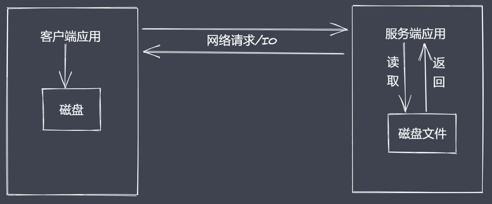
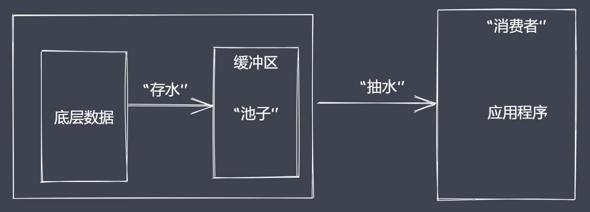
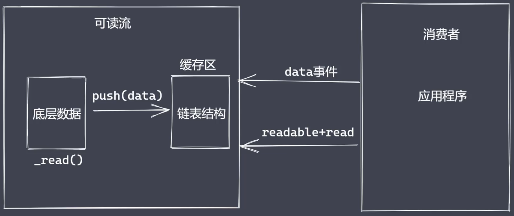
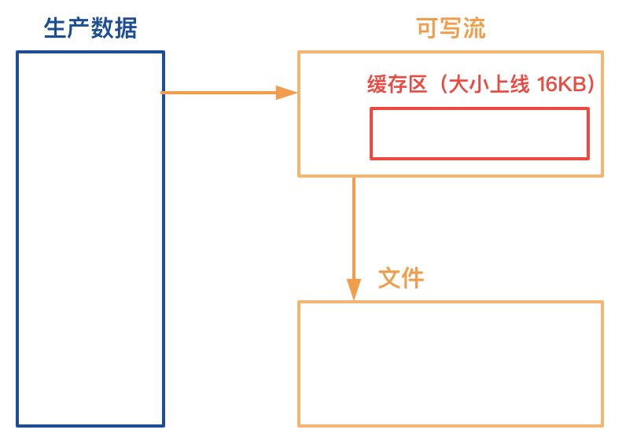
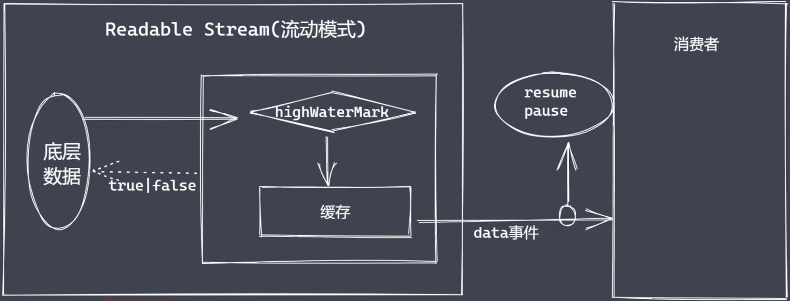
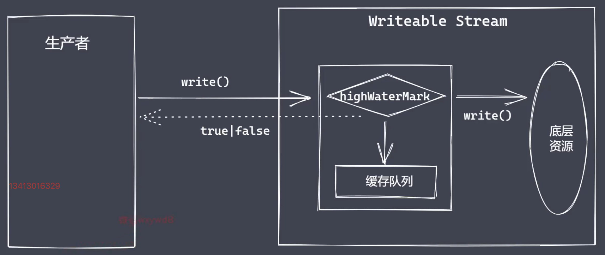
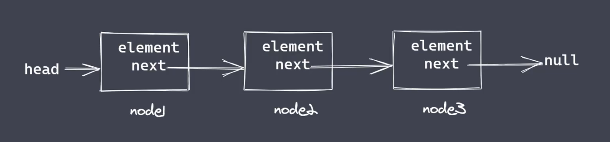

# Stream

文件操作系统和网络模块实现了流接口。

Node.js中的流就是处理流式数据的抽象接口。

## 应用程序中为什么使用流来处理数据？

不使用流加载文件的痛点：

- 同步读取资源文件，用户需要等待数据读取完成

- 资源文件最终一次性加载到内存，开销较大



流处理数据的优势：

- 时间效率：流的分段处理可以同时操作多个数据chunk

- 空间效率：同一时间流无需占据大的内存空间



- 使用方便：流配合管理，扩展程序变得简单


## Node.js中流的分类

- Readable：可读流，能够实现数据的读取

- Writeable：可写流，能够实现数据的写操作

- Duplex：双工流，即可读又可写，读写是独立的，读取的数据不能直接作为写操作的数据源

- Tranform：转换流，可读可写，还能实现数据转换，读写在底层是打通的

## Node.js流特点

- Steam模块实现了四个具体的抽象

- 所有流都继承自EventEmitter

```js
const fs = require('fs')

let rs = fs.createReadStream('./test.txt')
let ws = fs.createWriteStream('./test1.txt')

rs.pipe(ws)
```

## 可写流

### 自定义可读流

- 继承stream里的Readable

- 重写_read方法，调用push产出数据

```js
const { Readable } = require('stream')
// 自定义数据存放数据，模拟底层数据
let source = ['a', 'b', 'c', 'd']
// 自定义类继承 Readable
class MyReadable extends Readable {
  constructor(source) {
    super()
    this.source = source
  }

  _read() {
    let data = this.source.shift() || null
    this.push(data)
  }
}

// 消费数据
let myReadable = new MyReadable(source)

myReadable.on('readable', () => {
  let data = null
  while ((data = myReadable.read()) !== null) {
    console.log(data.toString())
  }
})

myReadable.on('data', (data) => {
  console.log(data.toString())
})
```


### 自定义可读流问题

- 底层数据读取完成之后如何处理？

  数据读取完成之后可以给Readable push一个null

- 消费者如何读取可读流中的数据？

  通过Readable的readable、date事件消费数据

**消费数据为什么需要两种方式？**

  主要是满足两个场景：

    1、只需要读取某一段数据

    2、源源不断的读取完整的数据

  因此readable内部有两种模式：流动模式、暂停模式。两者的区别在于是否需要调用read方法来读取数据

  

### 消费数据

- readable事件：当流中存在可读取数据时触发，暂停模式

- data事件：当流中数据快传给消费者后触发，流动模式

### 可读流总结

- 明确数据产生与消费流程

- 利用API实现自定义的可读流

- 明确数据消费的事件使用

## 可写流

### 自定义可写流

- 继承 stream 模块的 Writeable

- 重写_write方法，调用write执行写入

```js
const { Writable } = require('stream')

class MyWritable extends Writable {
  constructor() {
    super()
  }

  _write(chunk, en, done) {
    process.stdout.write(chunk.toString() + '---')
    // 写完之后再调用 done
    process.nextTick(done)
  }
}

// 创建可写流用于消费数据
let myWritable = new MyWritable()

// 执行数据写入

myWritable.write('abc', 'utf-8', () => {
  console.log('写入成功了')
})
```


### 可写流事件

- pipe事件：可读流调用pipe()方法时触发

- unpipe事件：可读流调用unpipe()方法时触发

## 双工流和转换流

### 自定义双工流

- 继承Duplex类

- 重写_read方法，调用push生产数据

- 重写_write方法，调用write消费数据

```js
const { Readable, Writable, Duplex } = require('stream')

// 模拟底层数据源
let source = ['a', 'b', 'c ']

// 自定义双工流
class MyDuplex extends Duplex {
  constructor(options) {
    super(source, options)
    this.source = source
  }

  _read() {
    let data = this.source.shift() || null
    this.push(data)
  }

  _write(chunk, enc, next) {
    if (Buffer.isBuffer(chunk)) {
      chunk = chunk.toString()
    }
    process.stdout.write(chunk + '-------')
    // write完成之后才调用next，所以使用了nextTick
    process.nextTick(next)
  }
}

// 实例化
let myDuplex = new MyDuplex(source)

myDuplex.on('data', (chunk) => {
  console.log(chunk.toString())
})

myDuplex.write('测试数据', 'utf-8', (chunk) => {
  console.log('双工流测试可写操作')
})
```


### 自定义转换流

- 继承 Transform 类

- 重写 _transform 方法，调用 push 和 callback

- 重写_flush方法，处理剩余数据

```js
const { Transform } = require('stream')

class MyTransform extends Transform {
  constructor(options) {
    super()
  }

  _transform(chunk, encoding, callback) {
    this.push(chunk.toString().toUpperCase())
    callback(null)
  }
}

let myTransform = new MyTransform()

myTransform.write('a')

myTransform.on('data', (chunk) => {
  console.log(chunk.toString()) // A
})
```

## 文件可读流的创建和消费

```js
const fs = require('fs')

let rs = fs.createReadStream('test.txt', {
  flags: 'r', // 文件系统flag值，默认'r' http://nodejs.cn/api/fs.html#fs_file_system_flags
  encoding: null, // 编码格式，默认 null，Buffer形式
  fd: null, // 文件描述符， 默认 null
  mode: 438, // 用于设置文件模式（权限和粘滞位），但仅限于文件被创建时
  autoClose: true, // 默认 true，当 'error' 或 'end' 事件时，文件描述符会被自动地关闭。如果为false， 发生错误时文件描述符不会被关闭
  start: 0, // start 和 end 值，用于从文件中读取一定范围的字节，而不是读取整个文件，从0开始计数
  // end: 3, // 默认值: Infinity
  highWaterMark: 4 // 默认值: 64 * 1024
})

// rs.on('data', (chunk) => {
//   console.log(chunk.toString())
//   rs.pause() // 流动模式切换为暂停模式
//   setTimeout(
//     () => {
//       rs.resume() // 暂停模式切换为流动模式
//     },
//     1000
//   )
// })

rs.on('readable', () => {
  let data
  while ((data = rs.read(1)) !== null) {
    console.log(data.toString())
    console.log('缓冲区长度：', rs._readableState.length)
  }
})
// 1
// 缓冲区长度： 3
// 2
// 缓冲区长度： 2
// 3
// 缓冲区长度： 1
// 4
// 缓冲区长度： 0
// 5
// 缓冲区长度： 3
// 5
// 缓冲区长度： 2
// 6
// 缓冲区长度： 1
// 7
// 缓冲区长度： 0
// 8
// 缓冲区长度： 2
// 9
// 缓冲区长度： 1
// 0
// 缓冲区长度： 0
```

### 文件可读流事件

```js
const fs = require('fs')

let rs = fs.createReadStream('test.txt', {
  flags: 'r',
  encoding: null,
  fd: null,
  mode: 438,
  autoClose: true,
  start: 0,
  // end: 3,
  highWaterMark: 4
})

let buffer = []
// 只要调用createReadStream就会触发open事件，不需要等待数据的传输
rs.on('open', (fd) => {
  console.log(fd, '文件打开了')
})

// 数据被消费之后才会触发
rs.on('close', () => {
  console.log('文件关闭了')
})

rs.on('end', () => {
  console.log('end 之后才处理数据：', Buffer.concat(buffer).toString())
  console.log('数据被清空了')
})

rs.on('error', (err) => {
  console.log('出错了')
})

rs.on('data', (chunk) => {
  buffer.push(chunk)
  console.log(chunk.toString())
})

// 21 文件打开了
// 1234
// 5567
// 890
// end 之后才处理数据： 12345567890
// 数据被清空了
// 文件关闭了
```

### 文件可写流以及事件

```js
const fs = require('fs')

let ws = fs.createWriteStream('test1.txt', {
  flags: 'w',
  mode: 438,
  fd: null,
  encoding: 'utf-8',
  start: 0,
  highWaterMark: 3 // 考虑到一个中文字符占用三个字节，不至于乱码
})

// 写入的内容的类型只能是：字符串、buffer，否则会报错
ws.write('abc', () => {
  console.log('ok1')
})

ws.write('efg', () => {
  console.log('ok2')
})

ws.on('open', (fd) => {
  console.log('文件打开了', fd)
})

// close 是在数据写入操作全部完成之后才执行，以end方法调用作为完成标识
ws.on('close', () => {
  console.log('文件关闭了')
})

// ws.write的参数类型错误是直接抛出错误，无法被error事件捕捉的
ws.on('error', (err) => {
  console.log('出错了', err)
})

// end 执行之后就意味着数据写入操作完成
ws.end('hij') // end方法也可以传需要写入的内容

// 在end之后write会报错，并被捕捉到
ws.write('create an error')
```

### write执行流程

```js
const fs = require('fs')

let ws = fs.createWriteStream('test3.txt', {
  highWaterMark: 3
})

let flag = ws.write('1')
console.log(flag) // true

flag = ws.write('2')
console.log(flag) // true

flag = ws.write('3')
console.log(flag) // false
```

1. 第一次调用 write 方法时是将数据直接写入到文件中

2. 第二次开始 write 方法就是将数据写入至缓存中

3. 生产速度和消费速度是不一样的，一般情况下生产速度要比消费速度快很多

4. 当 flag 为 false 之后并不意味着当前次的数据不能被写入了，但我们应该告知数据的生产者，当前的消费速度已经跟不上生产速度了，所以这个时候，一般我们会将可读流的模式修改为暂停模式

5. 当数据生产者暂停之后，消费者会慢慢的消化它们内部缓存中的数据，直到可以再次被执行写入操作

6. 当缓冲去可以继续写入数据时如何让生产者知道？ drain事件



```js
  // 通过控制state.writing，首次写入时（state.writing = false）是直接写入（doWrite），高于一次写入的是写到buffer中
  if (state.writing || state.corked) {
    var last = state.lastBufferedRequest;
    state.lastBufferedRequest = {
      chunk,
      encoding,
      isBuf,
      callback: cb,
      next: null
    };
    if (last) {
      last.next = state.lastBufferedRequest;
    } else {
      state.bufferedRequest = state.lastBufferedRequest;
    }
    state.bufferedRequestCount += 1;
  } else {
    doWrite(stream, state, false, len, chunk, encoding, cb);
  }
```

```js
// 从源码看写入的总长度超过highWaterMark就会设置needDrain为true，后续会触发drain事件
state.length += len;
var ret = state.length < state.highWaterMark;
// we must ensure that previous needDrain will not be reset to false.
if (!ret)
  state.needDrain = true;
return ret;
```

## drain事件与写入速度

drain事件不常用，更常用的是pipe。

```js
/**
 * 写入方式
 * 1、一次性写入
 * 2、分批写入
 */
const fs = require('fs');

let ws = fs.createWriteStream('test3.txt', {
  highWaterMark: 3
});

let source = '测试而已'.split('');
let flag = true;

function executeWrite() {
  flag = true;
  while (source.length && flag) {
    flag = ws.write(source.shift());
  }
}

executeWrite()

ws.on('drain', () => {
  console.log('drain event')
  executeWrite()
})
```

## 背压机制

生产者：



消费者：



示例：

```js
const fs = require('fs')

const rs = fs.createReadStream('test.txt', {
  highWaterMark: 4
})

const ws = fs.createWriteStream('test1.txt', {
  highWaterMark: 1
})

// let flag = true

// rs.on('data', (chunk) => {
//   flag = ws.write(chunk, () => {
//     console.log('写完了')
//   })
//   if (!flag) {
//     rs.pause()
//   }
// })

// ws.on('drain', () => {
//   rs.resume()
// })

rs.pipe(ws)
```

## 模拟可读流

```js
const fs = require('fs');
const EventEmitter = require('events');

class MyFileReadStream extends EventEmitter {
  constructor(path, options = {}) {
    super();
    this.path = path;
    this.flags = options.flags || 'r';
    this.mode = options.mode || 438;
    this.autoClose = options.autoClose || true
    this.start = options.start || 0;
    this.end = options.end;
    this.highWaterMark = options.highWaterMark || 64 * 1024;
    this.readOffset = 0;

    this.open();

    this.on('newListener', type => {
      if (type === 'data') this.read();
    })
  }

  open() {
    fs.open(this.path, this.flags, this.mode, (err, fd) => {
      if (err) {
        return this.emit('error', err);
      }
      this.fd = fd;
      this.emit('open', fd);
    })
  }

  read() {
    // fs open 是异步的，需要通过订阅发布模式来调用this.read
    if (typeof this.fd !== 'number') return this.once('open', fd => this.read());
    let buf = Buffer.alloc(this.highWaterMark);
    let howMuchToRead = this.end ? Math.min(this.end - this.readOffset + 1, this.highWaterMark) : this.highWaterMark;

    fs.read(this.fd, buf, 0, howMuchToRead, this.readOffset, (err, readBytes) => {
      if (readBytes) {
        this.readOffset += readBytes;
        this.emit('data', buf.slice(0, readBytes));
        this.read();
      } else {
        this.emit('end');
        this.close();
      }
    });
  }

  close() {
    fs.close(this.fd, (err) => {
      this.emit('close');
    });
  }
}

const rs = new MyFileReadStream('test.txt', {
  end: 7,
  highWaterMark: 3
});

rs.on('open', fd => {
  console.log('fd: ', fd);
});

rs.on('data', chunk => {
  console.log('chunk: ', chunk);
});

rs.on('end', () => {
  console.log('end: ');
});

rs.on('close', () => {
  console.log('close');
});
```

## 链表

### 链表分类

- 双向链表

- 单向链表

- 循环链表

### 链表结构



自行实现一个链表以及队列，示例如下：

```js
/* 
  01 node + head + null 
  02 head --->null 
  03 size 

  04 next element

  05 增加 删除 修改 查询 清空 
*/

class Node {
  constructor(element, next) {
    this.element = element
    this.next = next
  }
}

class LinkedList {
  constructor() {
    this.head = null
    this.size = 0
  }

  _getNode(index) {
    if (index < 0 || index >= this.size) throw new Error('cross the border')
    let currentNode = this.head
    let size = 0
    while (size < index) {
      size++
      currentNode = currentNode.next
    }
    return currentNode
  }

  add(index, element) {
    if (arguments.length === 1) {
      element = index
      index = this.size
    }
    if (index < 0 || index > this.size) throw new Error('cross the border')

    if (index === 0) {
      const head = this.head
      this.head = new Node(element, head)
    } else {
      const prevNode = this._getNode(index - 1)
      prevNode.next = new Node(element, prevNode.next)
    }
    this.size++;
  }

  remove(index) {
    let rmNode = null
    if (index === 0) {
      rmNode = this.head
      // 如果Queue一直在删除，会将链表全部清空了，此时会出现rmNode（head）是null的情况，转为undefined作为识别
      if (!rmNode) return undefined
      this.head = rmNode.next
    } else {
      const prevNode = this._getNode(index - 1)
      rmNode = prevNode.next
      prevNode.next = rmNode.next
    }
    this.size--
    return rmNode
  }
  set(index, element) {
    const node = this._getNode(index)
    node.element = element
  }
  get(index) {
    return this._getNode(index)
  }
  clear() {
    this.head = null
    this.size = 0
  }
}

class Queue {
  constructor() {
    this.linkedList = new LinkedList()
  }

  enQueue(data) {
    this.linkedList.add(data)
  }

  dlQueue() {
    return this.linkedList.remove(0)
  }
}


// const l1 = new LinkedList()
// l1.add('node1')
// l1.add('node2')
// l1.add(1, 'node3')
// l1.remove(1)
// l1.set(1, 'node3-3')
// let a = l1.get(0)
// l1.clear()
// console.log(l1)

const q = new Queue()

q.enQueue('node1')
q.enQueue('node2')
let b = q.dlQueue()
console.log(b)
console.log(q)
```

## 模拟可写流


```js
const fs = require('fs')
const EventEmitter = require('events')
const Queue = require('./12-one-way-linkedList')
const { darkslategray } = require('color-name')

class MyWriteStream extends EventEmitter {
  constructor(path, options = {}) {
    super()
    this.path = path
    this.flags = options.flags || 'w'
    this.mode = options.mode || 438
    this.autoClose = options.autoClose || true
    this.start = options.start || 0
    this.encoding = options.encoding || 'utf8'
    this.highWaterMark = options.highWaterMark || 16 * 1024

    this.writeOffset = this.start
    this.writeing = false
    this.writelen = 0
    this.needDrain = false
    this.cache = new Queue()

    this.open()
  }

  open() {
    // 原声 fs.open
    fs.open(this.path, this.flags, (err, fd) => {
      if (err) this.emit('error', err)
      // 正常打开文件
      this.fd = fd
      this.emit('open', fd)
    })
  }

  write(chunk, encoding, cb) {
    chunk = Buffer.isBuffer(chunk) ? chunk : Buffer.from(chunk)

    this.writelen += chunk.length

    let flag = this.writelen < this.highWaterMark
    this.needDrain = !flag

    if (this.writeing) {
      // 当前正在执行写入，所以内容应该排队
      this.cache.enQueue({ chunk, encoding, cb })
    } else {
      this.writeing = true
      // 当前不是正在写入那么就执行写入
      this._write(chunk, encoding, () => {
        cb && cb()
        // 清空队列的内容
        this._clearBuffer()
      })
    }

    return flag
  }

  _write(chunk, encoding, cb) {
    // open 是一个异步动作，有可能open还未成功，就已经在执行write了
    if (typeof this.fd !== 'number') {
      return this.once('open', () => { this._write(chunk, encoding, cb) })
    }

    fs.write(this.fd, chunk, this.start, chunk.length, this.write, (err, written) => {
      this.writeOffset += written
      this.writelen -= written
      cb && cb()
    })
  }

  _clearBuffer() {
    let data = this.cache.dlQueue()
    if (data) {
      this._write(data.element.chunk, data.element.encoding, () => {
        data.element.cb && data.element.cb()
        this._clearBuffer()
      })
    } else {
      // 需要发送drain事件
      if (this.needDrain) {
        this.needDrain = false
        this.emit('drain')
      }
    }
  }
}

const ws = new MyWriteStream('test2.txt', {
  highWaterMark: 1
})

ws.on('open', (fd) => {
  console.log('open ---->', fd)
})

ws.write('1', 'utf-8', () => {
  console.log('ok1')
})

ws.write('10', 'utf-8', () => {
  console.log('ok2')
})
```