# 通讯

## 通讯方式

- 交换机通讯

- 路由器通讯

### 如何建立多台主机互连？

 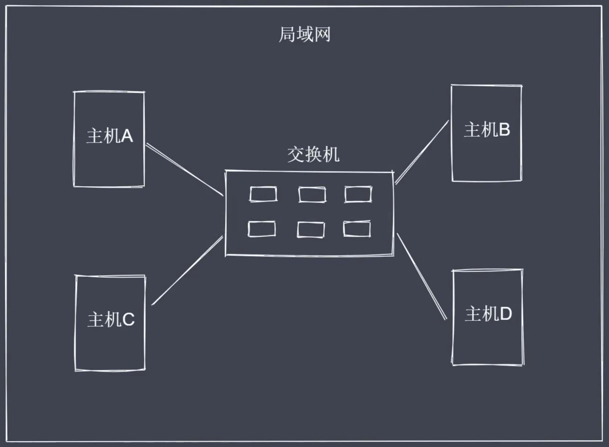

### 如何定位局域网中的其他主机？

 通过Mac地址来唯一标识一台主机。

 交换机通讯方式的问题？

 - 交换机的接口数量有上限

 - 局域网存在大量的主机会造成广播风暴

 ### 解决方案：路由器

  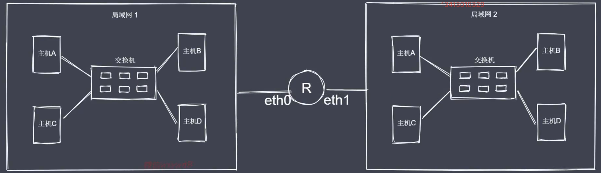

此时不仅需要知道对方的Mac地址，还需要知道在哪一个局域网里，即明确目标主机IP地址。包括：源Mac地址、源IP地址、目标Mac地址、目标IP地址。

## 网络层次结构

### OSI七层模型

- 应用层：用户与网络接口

- 表示层：数据加密、转换、压缩

- 会话层：控制网络连接建立与终止

- 传输层：控制数据传输可靠性

- 网络层：确定目标网络

- 数据链路层：确定目标主机

- 物理层：各种物理设备和标准

### TCP/IP五层模型

- 应用层：用户与网络接口

- 传输层：控制数据传输可靠性

- 网络层：确定目标网络

- 数据链路层：确定目标主机

- 物理层：各种物理设备和标准

### 数据的封装与解封装

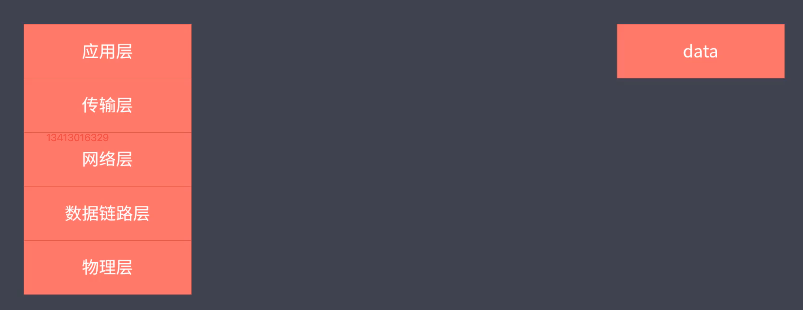

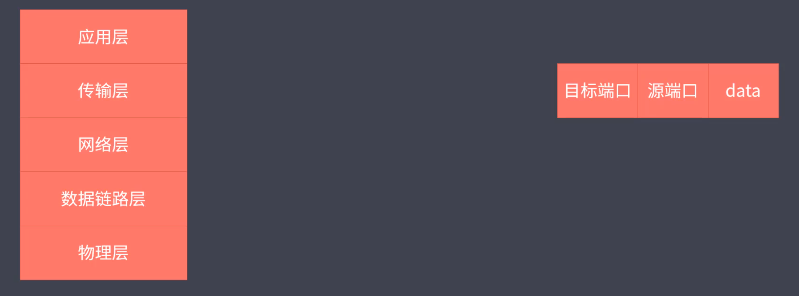

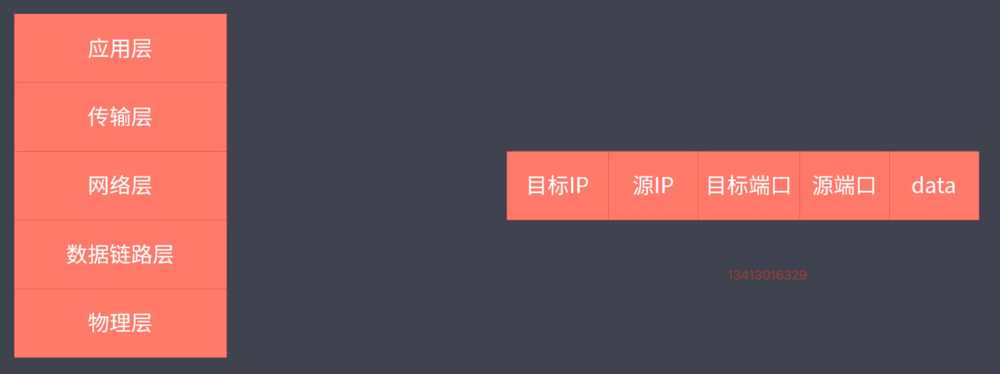

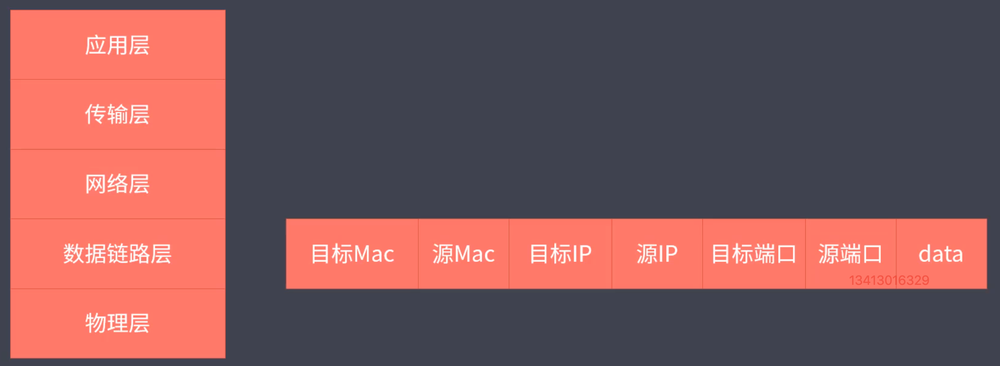

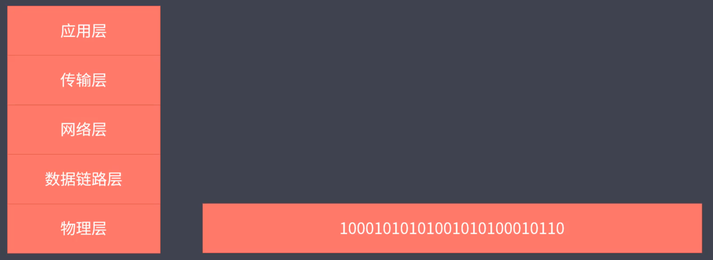

## 三次握手与四次挥手

### TCP协议

- TCP属于传输层协议

- TCP是面向连接的协议

- TCP用于处理实时通信

### TCP报文协议结构

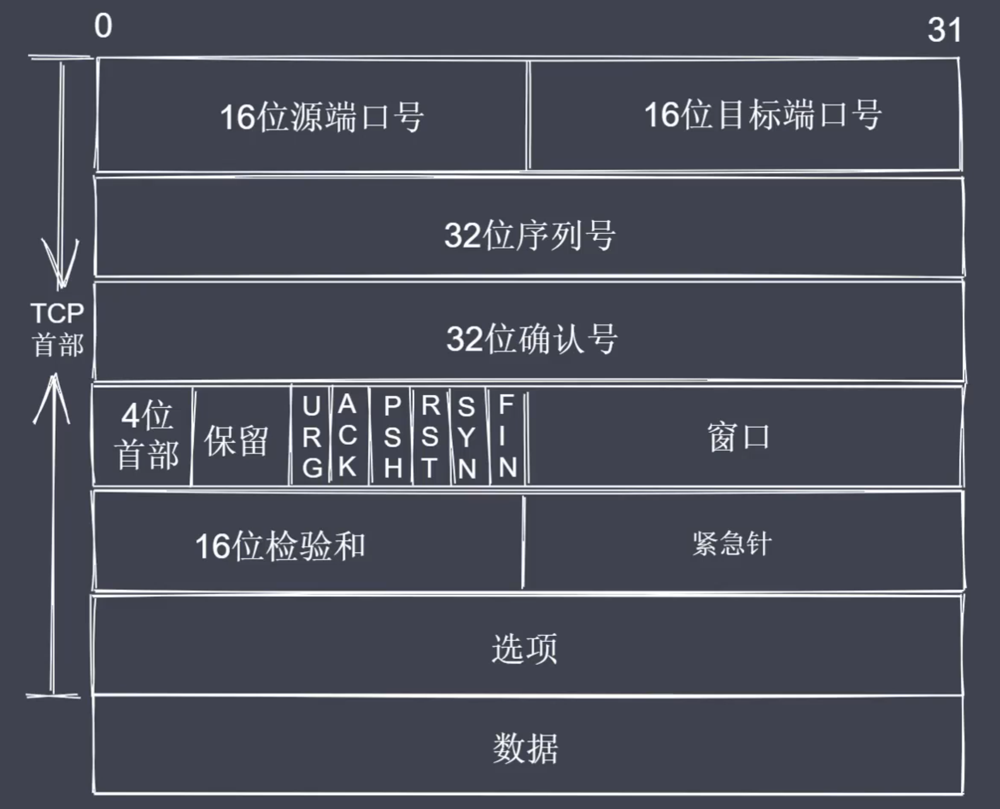

常见报文字段

- SYN=1 表示请求建立连接

- FIN=1 表示请求断开连接

- ACK=1 表示数据信息确认

### 三次握手

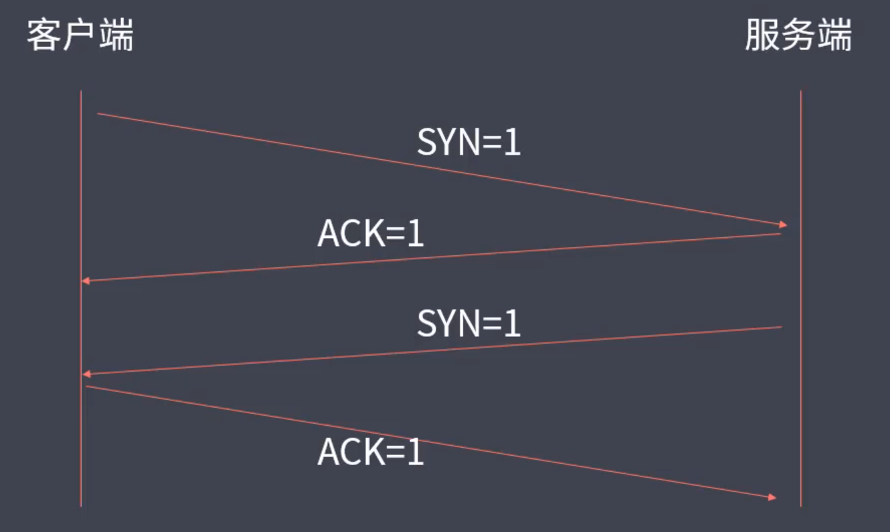

实际上服务器端会将SYN、ACK一起返回。从而变成三次握手。

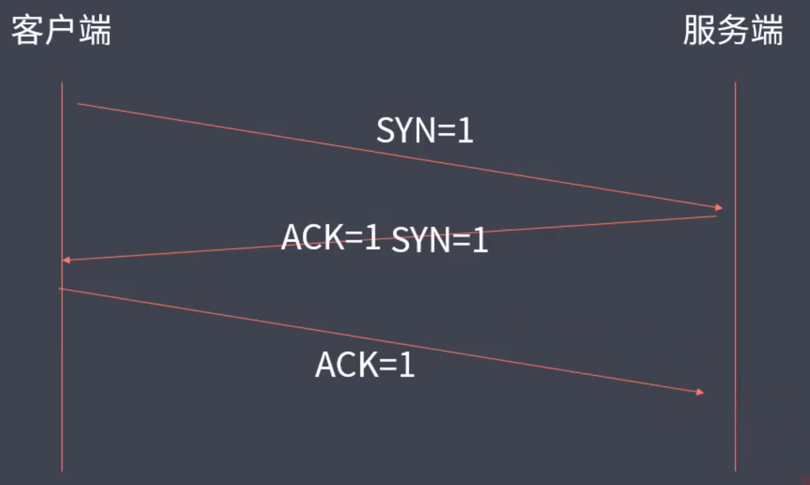

### 四次挥手

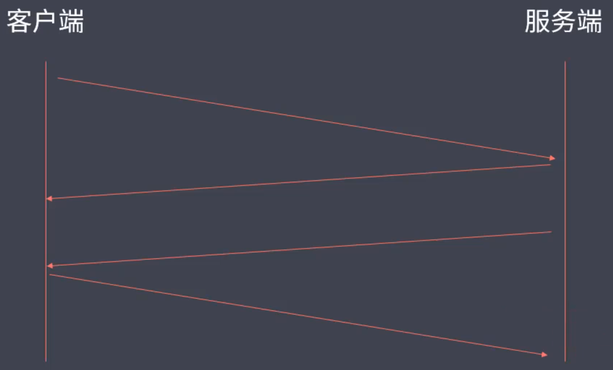

**为什么服务器端不将ACK、SYN一起返回呢**

因为一个服务器端可能同时服务多个客户端，当某一个客户端发出断开连接的请求时，服务器端针对该客户端的数据传输可能还没有全部输送完毕，需要等待输送完毕之后，服务器端才会发送断开的请求。
